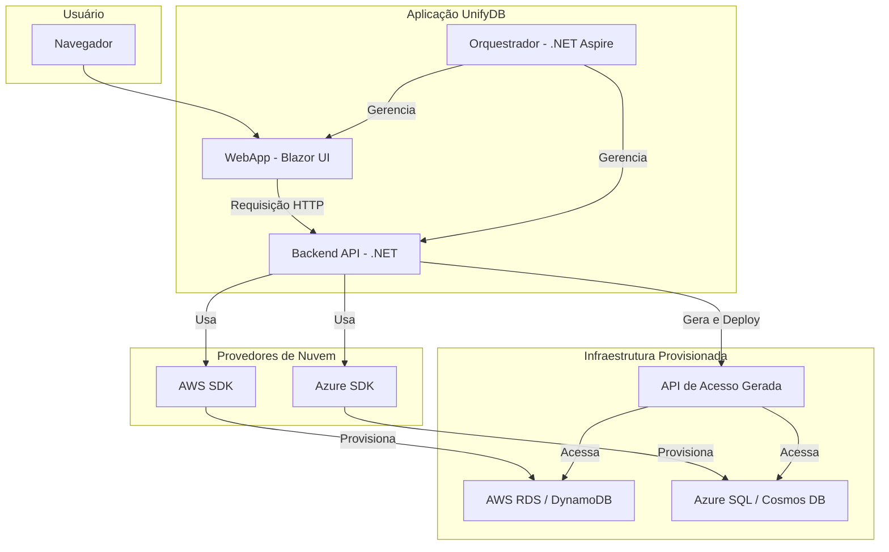

# UnifyDB: Provisionamento Unificado de Bancos de Dados

**UnifyDB** é uma plataforma de engenharia de software que simplifica e automatiza o provisionamento de bancos de dados em múltiplos provedores de nuvem através de uma interface gráfica única e intuitiva.

## Visão Geral

A complexidade de criar, configurar e gerenciar bancos de dados em diferentes ambientes de nuvem (como AWS e Azure) e com diferentes tecnologias (SQL e NoSQL) pode ser um grande obstáculo para equipes de desenvolvimento. O UnifyDB resolve esse problema ao fornecer um ponto central de controle, abstraindo a complexidade das APIs de cada provedor e oferecendo um fluxo de trabalho padronizado.

## ✨ Funcionalidades e Requisitos

### Requisitos Funcionais (RF)
*Descrevem **o que** o sistema deve fazer.*

*   **RF01: Provisionamento de Banco de Dados**
    *   O sistema deve permitir que um usuário inicie o processo de criação de um novo banco de dados.
    *   O usuário deve poder especificar parâmetros como Provedor de Nuvem, Tipo de Banco de Dados, Nome e Região.

*   **RF02: Interface Gráfica Unificada (GUI)**
    *   O sistema deve fornecer uma interface web para todas as interações do usuário.
    *   A GUI deve conter um formulário claro para submeter as requisições e exibir feedback sobre o status.

*   **RF03: Suporte a Múltiplos Provedores de Nuvem**
    *   O sistema deve ser capaz de interagir com as APIs da **AWS** e do **Azure** para provisionar recursos.

*   **RF04: Suporte a Múltiplas Tecnologias de Banco de Dados**
    *   O sistema deve suportar a criação de bancos de dados **relacionais (SQL)** e **não relacionais (NoSQL)**.

*   **RF05: Gerenciamento do Ciclo de Vida**
    *   O sistema deve permitir a visualização e a exclusão de bancos de dados provisionados.

*   **RF06: Geração de Acesso (Avançado)**
    *   (Futuro) O sistema poderá gerar e implantar uma API de acesso (REST/gRPC) pré-configurada para o novo banco de dados.

### Requisitos Não Funcionais (RNF)
*Descrevem **como** o sistema deve operar e seus atributos de qualidade.*

*   **RNF01: Usabilidade**
    *   A interface deve ser intuitiva, minimizando a necessidade de consultar documentação externa. As mensagens de erro devem ser claras.

*   **RNF02: Desempenho**
    *   A API deve responder rapidamente (<500ms para validação). O provisionamento, por ser uma operação longa, deve ser executado de forma assíncrona.

*   **RNF03: Segurança**
    *   Credenciais de nuvem e strings de conexão devem ser gerenciadas de forma segura (ex: Key Vault, Secrets Manager) e nunca expostas no código ou na UI. A comunicação deve ser via HTTPS.

*   **RNF04: Escalabilidade**
    *   A arquitetura deve ser stateless para permitir escalabilidade horizontal. O design deve facilitar a adição de novos provedores e tipos de banco de dados.

*   **RNF05: Confiabilidade**
    *   O sistema deve ter tratamento de erros robusto, com logs e mecanismos de retentativa para falhas transitórias.

*   **RNF06: Manutenibilidade e Extensibilidade**
    *   O código deve seguir princípios de design SOLID e encapsular a lógica de cada provedor em módulos separados (Padrão Strategy/Factory).

*   **RNF07: Observabilidade**
    *   O sistema deve gerar logs estruturados, suportar tracing distribuído e expor health checks, aproveitando os recursos do .NET Aspire.

## 🏛️ Arquitetura

O UnifyDB é projetado como um sistema distribuído, orquestrado pelo .NET Aspire.

